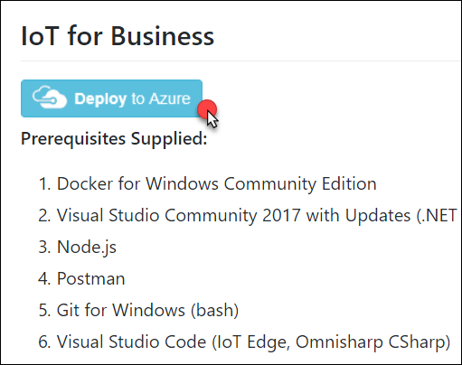
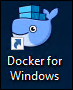

# IoT for business setup

## Requirements

-   Microsoft Azure subscription (non-Microsoft subscription) where you are at least a co-administrator

-   **Global Administrator role** for Azure AD within your subscription

-   Local machine or a virtual machine configured with (**complete the day before the lab!**):

    -   Visual Studio Code version 1.19.2 or higher

        -   <https://code.visualstudio.com/>

    -   Azure IoT Edge extension for Visual Studio Code

        -   <https://marketplace.visualstudio.com/items?itemName=vsciot-vscode.azure-iot-edge>

    -   C\# for Visual Studio Code (powered by OmniSharp) extension

        -   <https://marketplace.visualstudio.com/items?itemName=ms-vscode.csharp>

    -   Docker on the same computer that has Visual Studio Code (Community Edition (CE) is sufficient)

        -   <https://docs.docker.com/engine/installation/>

    -   .NET Core 2.0 SDK

        -   <https://www.microsoft.com/net/core#windowscmd>

    -   Visual Studio Community 2017 or greater, version 15.4 or higher

        -   <https://www.visualstudio.com/vs/>

    -   Azure development workload for Visual Studio 2017

        -   <https://docs.microsoft.com/azure/azure-functions/functions-develop-vs#prerequisites>

    -   .NET desktop development workload for Visual Studio 2017

    -   ASP.NET and web development workload for Visual Studio 2017

    -   Node.js (install using either the 32-bit or 64-bit Windows Installer (.msi) option)

        -   <https://nodejs.org/en/download/>

    -   Postman app

        -   <https://www.getpostman.com/apps>

    -   Bash client (such as Git Bash or Bash on Ubuntu for Windows)

        -   Instructions for installing the Windows Subsystem for Linux for using Bash: <https://docs.microsoft.com/en-us/windows/wsl/install-win10>

## Before the hands-on lab

**Duration:** 60 minutes

In this exercise, you will set up your environment you will use for the rest of the exercises.

### Task 1: Perform a deployment of the LABVM

In this task you will perform a deployment of a the VM that will be used during this lab.

1.  Open a new private or incognito tab in your web browser, and then connect to <https://github.com/solliancenet/LABVM>.

2.  Scroll down and locate the **IoT for Business** selection and click the **Deploy to Azure** button.

    

3.  You will need to then authenticate with Azure.

    

4.  On the Custom Deployment page enter IoTBusiness as the Resource group and select a Location close to you.

    

5.  Next, update the LABVM DNS Name providing a globally unique name 3-24 alpha-numeric characters which are lowercase. Check the I agree to the terms and conditions stated above and then click Purchase.

    

Note: The VM will take about 45 minutes to provision. You will need to wait for this deployment to complete prior to continuing.

6.  Once the Deployment completes, you can locate your VM in the **IotBusiness** Resource group. Open the **LABVM** and click **Connect**.

    

7.  Login to the LABVM using the following credentials.

    a.  Username: demouser

    b.  Password: Password.1!!

        

8.  A Remote Desktop Warning will appear. Click **Don't ask me again for connections to this computer** and they click **Yes**.

    

9.  You will receive a message about allowing your PC to be discoverable. Click **No**.

    

10. Once connected double click the Docker Icon to start the application. This will take a couple of minutes to start. You can click in the taskbar to ensure that is reads "Docker is Starting"

     

11. When Docker for Windows is up and running you will receive the following message.

    

### Task 2: Validate connectivity to Azure

-   From within the virtual machine, launch **Visual Studio** and validate that you can log in with your Microsoft Account when prompted.

-   Validate connectivity to your Azure subscription. Launch Visual Studio, open **Server Explorer** from the View menu, and ensure that you can connect to your Azure subscription.

### Task 3: Download and explore the solution files

-   Create a new folder on your C: drive named IoTLab.

-   Download the sample application from here: <http://bit.ly/2E6LTT9> and extract to the IoTLab folder. You will need to copy and paste the URL into your browser, as Ctrl+Click does not honor casing in the URL.

> Note: The link above is case sensitive.

The solution is comprised of the following:

|    |            |
|----------|:-------------:|
|  **File / folder name**  | **Description** |
|  azure-iot-pcs-remote-monitoring-dotnet |A version of the [Azure IoT Remote Monitoring solution](https://github.com/Azure/azure-iot-pcs-remote-monitoring-dotnet), which can also be found on Azure IoT Suite. In our lab, this serves as the custom web front-end for viewing simulated IoT device telemetry, setting alert rules, and sending cloud-to-device commands. This is also used for creating new device simulations.  |
|  ReadEngineAlerts      |  tarter project for a custom C\# IoT Edge module that generates vehicle telemetry |
|  VehicleTelemetrySimulator   | Starter project for a custom C\# IoT Edge module that generates vehicle telemetry  |
|  sample-vehicle-telemetry.json   |  Contains 5,000 vehicle telemetry messages, used for testing the IoT Edge Stream Analytics module |